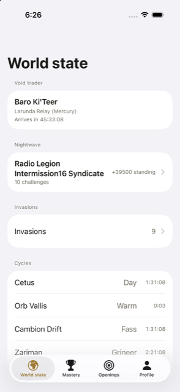
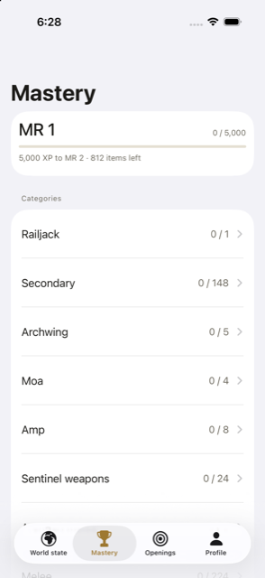
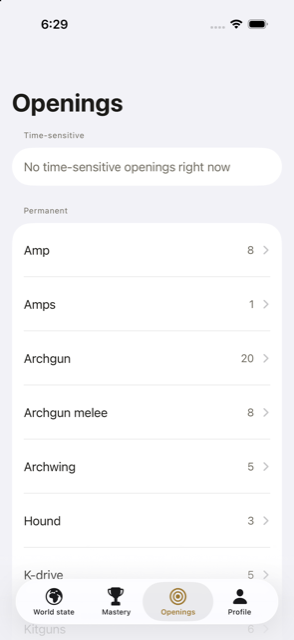
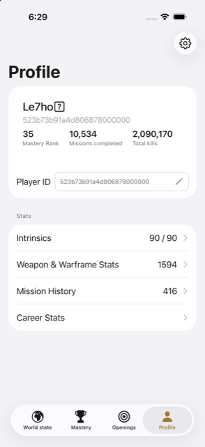
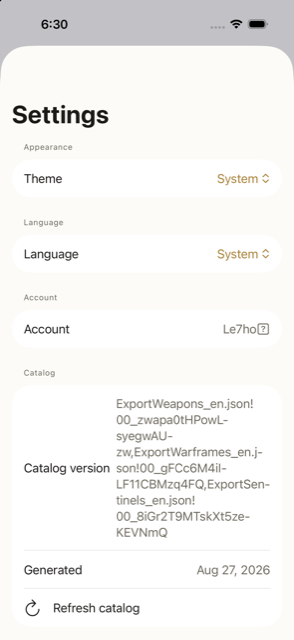

# TennoWatch

An iOS app for tracking Warframe Mastery Rank progress, built for pesonal use because no such tool exists on iOS.

## About

Warframe's Mastery system spans hundreds of weapons, warframes, and other rankable items, but there's no iOS app to track what's left to master or when a needed item is actually available. TennoWatch fills that gap: it matches your account's profile against the full item catalog, then cross-references the remaining items against live game state to tell you when and where you can actually get them.

It's built on a modern iOS stack — Swift 6 strict concurrency, SwiftUI, SwiftData, MVVM+C — against Warframe's real, constantly changing data feed rather than static sample data.

## Features

| Tab | What it does |
|---|---|
| **World State** | Live invasions, fissures, sorties, Nightwave challenges, the Void Trader, and open-world day/night cycles (Cetus, Vallis, Cambion, Zariman). |
| **Mastery** | Tracks mastery rank progress against the full item catalog, broken down by category and source, including intrinsics and Steel Path variants. |
| **Openings** | Cross-references your remaining mastery items against live world state to surface time-sensitive ways to get them — an invasion carrying the item as a reward, the Void Trader stocking it, etc. |
| **Profile** | A player's public stats, missions, and inventory, pulled from the Warframe profile API. |
| **Settings** | Theme (system/light/dark), language, and manual mastery-catalog refresh with version/generation-date info. |

Deeper specs for each tab and layer live in [Specs/](Specs/).

  
  
  
  
  

## Requirements

- Xcode 26 or later
- iOS 26.5+ (iPhone/iPad)
- Swift 6

## Getting Started

1. Clone the repo.
2. Open `TennoWatch.xcodeproj` in Xcode.
3. Build and run — no API key or configuration needed, the app talks to public endpoints.

The Profile tab currently points at a hardcoded `playerId` rather than a search/lookup flow — see [Roadmap](#roadmap--work-in-progress).

The Mastery catalog itself is generated offline: [Scripts/generate_catalog](Scripts/generate_catalog) fetches Digital Extremes' live `PublicExport` feed and rebuilds [TennoWatch/Resources/masterycatalog.json](TennoWatch/Resources/masterycatalog.json) from scratch (`cd Scripts/generate_catalog && npm install && npm run generate`), and [Scripts/itemMapper.py](Scripts/itemMapper.py) separately maps game item paths to display names into [Generated/ExternalData.swift](Generated/ExternalData.swift). Both are checked into the repo; you only need to re-run them after a game update adds new items.

## Architecture

| Layer | Folder | Purpose |
|---|---|---|
| Networking | `Networking/` | `APIManager` + `Endpoint` — plain `async`/`await` over `URLSession`, talking to `api.warframestat.us` and `api.warframe.com`. |
| Persistency | `Persistency/` | SwiftData, via a `@ModelActor` service and a `ValueTypeConvertible`/`PersistentModelConvertible` pair that keeps plain value types at the repository/ViewModel boundary instead of leaking `@Model` classes upward. |
| Repositories | `Repositories/` | One repository per data domain; owns cache policy, fronts networking + persistency. |
| Coordinators | `Coordinators/` | Per-tab `@Observable` coordinator owning a `NavigationPath` + `Destination` enum; views push by value instead of building the next screen inline. |
| Services | `Services/` | Stateless business logic — catalog↔profile merge, openings matching, error queue. |
| Models | `Models/` | Network DTOs, SwiftData-adjacent value models, view-facing derived models. |
| Theme & Shared UI | `Theme/` | Palette, reusable SwiftUI components, list styling, and a narrow UIKit-appearance bridge (`AppearanceProxies`) for nav-bar/tab-bar tinting SwiftUI can't do natively yet. |
| Localization | `Resources/` | `Strings` namespace + `Localizable.xcstrings`, with runtime language switching. |
| Testing | `TennoWatchTests/` | Swift Testing coverage, fixtures — see [Testing](#testing). |

Cross-cutting:

- **MVVM+C.** View → `@Observable` ViewModel → Repository protocol → (Service +) Networking/Persistency. Navigation lives in per-tab `Coordinator` objects (`Coordinators/`) that own a `NavigationPath` and resolve a `Destination` enum via `.navigationDestination(for:)` — views push by value, not by building the next view inline. Introduced first for Mastery, the tab with real drill-down; other tabs will get their own coordinator once their navigation grows past single-level.
- **Swift 6** strict concurrency, target-wide default `MainActor` isolation (Approachable Concurrency) — most types need no explicit `@MainActor`. `DefaultPersistencyService` is the one actor doing real off-main work (`@ModelActor`).
- **Manual dependency injection** via [`AppDependencies`](TennoWatch/AppDependencies.swift), constructed once and threaded down through views to ViewModels. No DI container.
- **SwiftUI** only, with UIKit interop limited to the one appearance-proxy bridge noted above.

## Testing

Swift Testing, covering networking, repositories, sync/matching services, and one ViewModel so far (`TennoWatchTests/`). Coverage is intentionally partial while the app is still taking shape.

## Data Source

- World state and the mastery catalog come from [`api.warframestat.us`](https://docs.warframestat.us/), a community-run API maintained by [Warframe Community Developers (WFCD)](https://github.com/WFCD). It wraps Digital Extremes' own public world-state feed — the same feed used by Digital Extremes' official companion app — rather than anything reverse-engineered from the game client.
- Profile data comes from Digital Extremes' own public profile-viewer endpoint (`api.warframe.com`), the same one the in-game and web profile viewers use.

## Roadmap / Work in Progress

- **Push notifications (APNs)** — surfacing time-sensitive openings (an invasion or Void Trader stock matching a needed item) as a push alert, so you don't have to have the app open. Not wired up yet.
- **Combine** — the network/data layer is currently plain `async`/`await`; adopting Combine for live-updating state (e.g. streaming world-state changes) is on the roadmap, not yet implemented.
- **Player search/lookup** — Profile currently reads from a hardcoded account ID; a real search flow is the next planned feature there.
- **Platform selector** — World State is hardcoded to PC; PS/Xbox/Switch support is unimplemented.
- **Coordinators for the remaining tabs** — World State, Openings, and Profile still navigate via inline `NavigationLink(destination:)`; they'll each get a `Coordinator` once their drill-down grows past single-level, following the pattern introduced in Mastery.

## Legal

This is an unofficial, non-commercial, fan-made project. It is **not affiliated with, endorsed by, or sponsored by Digital Extremes**. WARFRAME® and all related game data, names, and assets are the property of Digital Extremes Ltd.

- All Warframe-related data displayed by this app is fetched live from a public API at runtime — no Warframe game data, images, or other assets are bundled with or committed to this repository.
- This project is for personal, non-commercial use only, in line with Digital Extremes' [Content Policy](https://www.warframe.com/en/contentpolicy), [Terms of Use](https://www.warframe.com/en/terms), and [EULA](https://www.warframe.com/en/eula-us).
- The MIT license below covers the original source code in this repository only. It does not grant any rights to Warframe's name, trademarks, artwork, or game data.

## License

This project's source code is licensed under the [MIT License](LICENSE).
